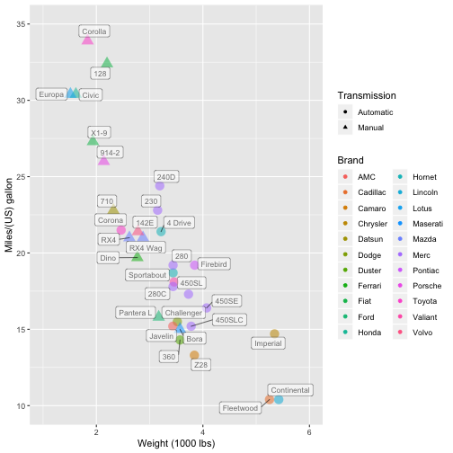

Reproducible Pitch Presentation: Shiny App
========================================================
author: Jeff B
date: April 15, 2020
autosize: true

Introduction
========================================================

This presentation is for the final course project of the Coursera course Developing Data Products. The assignment was to create a Shiny app and a 5-slide R Studio presentation to accompany it. This presentation is structured as follows:
- Title page
- Introduction (this page)
- Overview of the Shiny app itself
- UI-side code of the app
- Server-side code of the app

Overview of the Shiny app
========================================================

<font size="4">
<a href="https://jgbond.shinyapps.io/devdataproj/">Link to the app</a>

This very simple app allows the user to manipulate views of the dataset mtcars. This dataset contains data on Motor Trend Car Road Tests from 1974 and is commonly used in statistics classes.

The app provides 5 key variables that the user can change: number of cylinders, displacement, horsepower, transmission type, and brand.

As the user changes the variables, the user can view live changes on a plot. The plot displays weight on the x axis and miles per gallon (mpg) on the y axis. The plot characters feature colors corresponding with brand, shapes corresponding with transmission type, and labels corresponding with the model.

***

The output plot looks like this:</font>


UI-side code
========================================================
<font size="3">

```r
library(shiny)

shinyUI(fluidPage(
    # Make horizontal lines more aesthetically pleasing
    tags$head(
      tags$style(HTML("hr {border-top: 1px solid #C0C0C0;}"))),

    # Application title
    titlePanel("Motor Trend Car Road Tests from 1974"), hr(),
    
    # Sidebar with a slider input for variables
    sidebarLayout(sidebarPanel(
        h3("Car Variables"),
        p("Adjust these variables to configure
          your car options"), hr(),
        sliderInput("cyl1", "Number of cylinders:", min = 4,
                    max = 8, value = c(4,8), step = 2), hr(),
        sliderInput("disp1", "Displacement:", min = 70,
                    max = 480, value = c(70,480), step = 10),
        hr(),
        sliderInput("hp1", "Horsepower:", min = 50, max = 350,
                    value = c(50,350), step = 50), hr(),
        checkboxGroupInput("transGroup",
                           label = h4("Transmission Type"),
                           choices = unique(df$am),
                           selected = unique(df$am)),
        p("You must select at least
          one transmission type"), hr(),
        checkboxGroupInput("brandGroup", label = h4("Brand"),
                           choices = unique(df$brand),
                           selected = unique(df$brand)),
        p("You must select at least one brand")
      ),

      # Show the plot
      mainPanel(
        p("Car models that meet your specification
          will appear below"), hr(),
        h3("Cars by Weight and MPG"),
        plotOutput("carPlot")
      )
    )
))
```
</font>
***
<font size="4">The UI-side code is fairly straightforward.

In the side panel, we set up the input variables, along with some simple horizontal lines to provide a little more aesthetic to the design.

In the main panel, we display the plot.

A little bit of instruction is sprinkled throughout in lieu of formal documentation.

The data on display in this presentation is messily formatted because it was squeezed to fit into the page.</font>

Server-side code
=========================================================
<font size="4">

```r
library(shiny); library(tidyverse); library(ggrepel)

shinyServer(function(input, output) {
    # Load and tidy the data we need
    df <- mtcars; df$am <- as.factor(df$am)
    # Convert numerical values of transmissions into text
    levels(df$am) <- c("Automatic", "Manual")
    # Create brand and model variables
    df <- mutate(df, brand = sub("(\\w)\\ .*", "\\1", rownames(mtcars)), car = rownames(mtcars))
    df <- mutate(df, model = str_split_fixed(df$car, " ", 2)[,2])
    output$carPlot <- renderPlot({
        minCyl <- input$cyl1[1]; maxCyl <- input$cyl1[2]
        minDisp <- input$disp1[1]; maxDisp <- input$disp1[2]
        minHp <- input$hp1[1]; maxHp <- input$hp1[2]
        # Filter dataset by user input variables
        df2 <- filter(df, cyl >= minCyl, cyl <= maxCyl, disp >= minDisp, disp <= maxDisp, hp >= minHp,
                      hp <= maxHp, am %in% input$transGroup, brand %in% input$brandGroup)
        # Create a warning if users remove essential variables
        validate(need(input$transGroup, "Choose at least one transmission type"))
        validate(need(input$brandGroup, "Choose at least one brand"))
        # Create final plot
        ggplot(data = df2, aes(x = wt, y = mpg, color = brand, alpha = 0.7, shape = am, size = 2)) +
            geom_point() + labs(x = "Weight (1000 lbs)", y = "Miles/(US) gallon",
                                shape = "Transmission", color = "Brand") +
            xlim(1, 6) + ylim(10, 35) + guides(size = FALSE, alpha = FALSE) +
            geom_label_repel(label = df2$model, size = 3, color = "black")
    })
})
```
</font>
***
<font size="4">The server-side code is slightly more complicated.

First it loads necessary packages and data.

Then it tidies and processes some of the data to prepare it for plotting.

It then connects the input variables with a filter() function on the data to be plotted. This is essentially how this app works.

Finally it builds the plot using the newly filtered data.

The data on display in this presentation is messily formatted because it was squeezed to fit into the page.</font>
